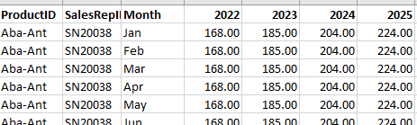
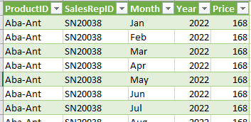
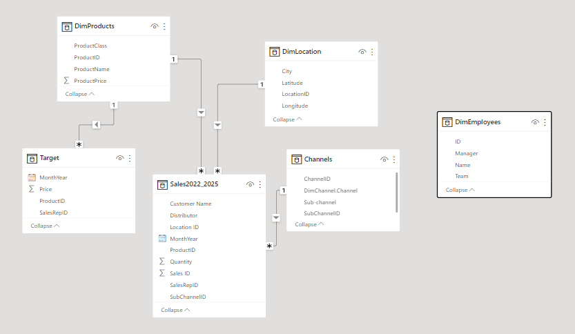
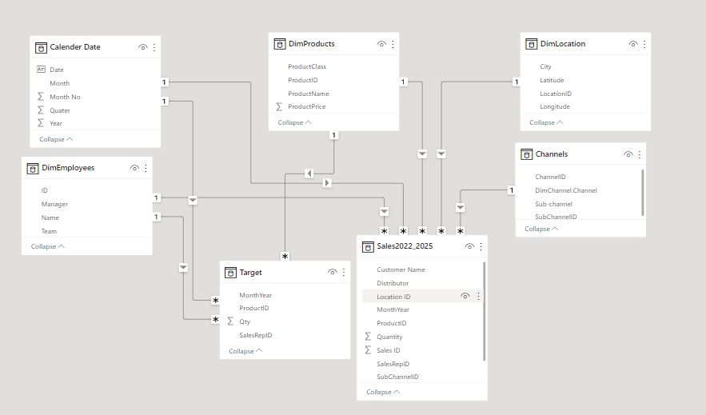
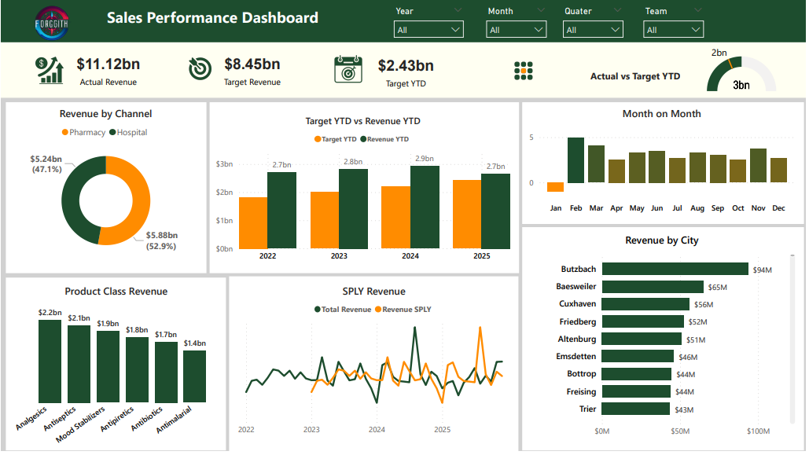
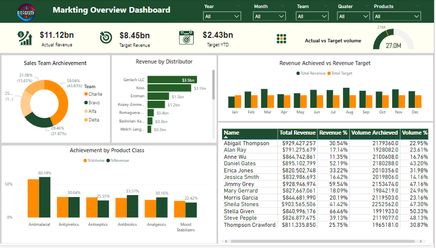

# Pharmaceutical Industry Analysis 

    

## Intoduction 
The pharmaceutical industry is known by rapid advancement in research and development and constant pursuit of innovative solutions to address global health challenges. In this context my analysis seeks to provide valuable insight and analyzing the key performance indicator (KPI) of the pharmacy while communicating the trends or pattern in sales and target of the suppliers

## Company overview 

Forggith pharmaceutical (Forggith) is a manufacturing company located in Germany operating in Business- to – Business mode. They specialized in producing medical drugs that get to the end users through their registered distributor. 

### Data Source

 This dataset (csv) was provided by Foresight BI. This is the combination of sales data and also the target data. 
-	Sales data workbook contains the following sheet; Location, Product, Channel, Sub Channel, Employees, and sales record from 2022 – 2025
-	Target sales data from 2022 – 2025

  **Data Description** 
1.	Product ID: The unique identifier for each product
2.	Product Name: The name for each product in relative to product Id
3.	Product Class: The class for each product
4.	Product price: The cost of each product
5.	Sales Rep ID: The unique Identifier for each sales rep
6.	Month: Month of the year which the transaction took place 
7.	Location ID: Identifier for geographic location 
8.	City: The name of the geographical location 
9.	Longitude: Angular distance of place in the east or west of greenish meridian 
10.	Latitude:  Angular distance of a place on North or South of Equator 
11.	Channel ID: The unique identifier for each channel 
12.	Subchannel ID: The unique identifier for each subchannel
13.	Channel: The name of each channel
14.	Sub-channel: The name of each sub channel
15.	ID: The unique identifier for each employee
16.	Name: Names of each employee
17.	Manager: The manager’s name for the employee relative to its ID
18.	Team: The team for each employee in correspondence to its ID
19.	Sales ID: The unique Identifier for each sale
20.	Month-Year: The month and year for the sale transaction 
21.	Distributor: The agent for goods supply
22.	Customer Name: The name given of the customer
23.	Quantity: The total number of goods purchased

## Scope of Analysis 

This analysis focuses on market growth and sales performance. I examine key performance indicators (KPIs);
-	Sales performance KPIs: Total Revenue, Total Revenue YTD, Total Revenue Previous year, Total revenue same period last year. Total target, Actual Revenue vs Target revenue YTD
-	Marketing Performance KPIs: Volume Achieved, Volume Achievement, Volume achieved by Sales representative

The insight generated through this analysis are expected to play a role in shaping Forggith strategic decision. 

## Data Transformation 

 I employed Power Query and Power BI DAX as a tool for the transformation. 
 
-	The sales data workbook had different sheet for the sales 2022 and sales from 2023 – 2025 Therefore the power query was used to combined the two sheets. 
-	The target data were grouped by years(2022, 2023, 2024,2025) which will affect my yearly analysis I created new column for year where all the years were group and transformed to date data type

  Old Column                |    New Column
:-------------------------: | :-----------------------:
:       : | :       :

## Data Modeling 
The dataset was imported into Power BI for other analysis and Visualization. 
Power BI created a default relationship for the tables excluding two, so I create a suitable model for this project using the common key between tables. Star schema was used in this project having the Sales and Target Tables as the fact tables. 
In other to calculate the time intelligence KPIs the master calendar table was created and connect to the fact table. 

**Old Model**

**New Model**

## DATA VISUALIZATION 

After having a good exploratory analysis on the dataset, the important KPIs were presented using the company brand color pallete. The dashboard communicating my findings is shown below 

**Sales Dashboard**

**Marketing  Dashboard**

